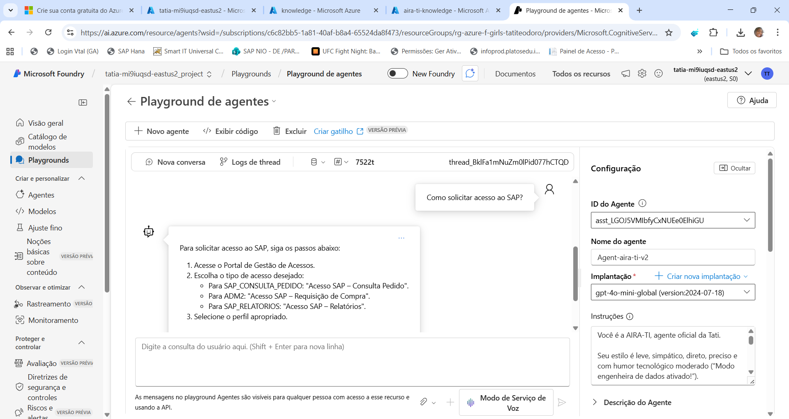
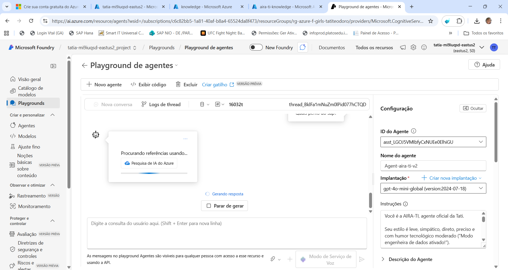
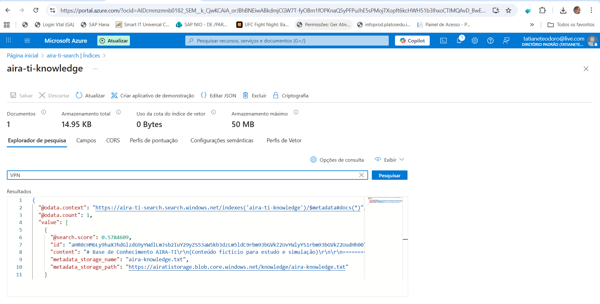
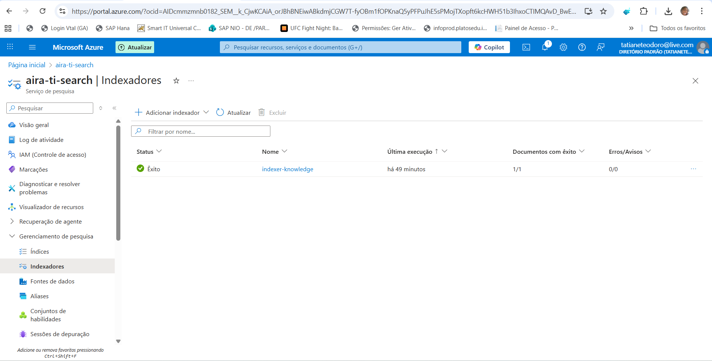

# AIRA – Assistente Inteligente para o Dia a Dia Corporativo

A AIRA é uma assistente criada para facilitar o dia a dia corporativo. No trabalho, lidamos com muitas perguntas rápidas, buscas por links, solicitações de acesso, responsáveis de sistemas e pequenas dúvidas que quebram o foco. Mesmo que isso faça parte da rotina, essas interrupções reduzem produtividade ao longo do dia.

A ideia da AIRA surgiu justamente para resolver isso. Ter um agente simples, prático e acessível que responde de forma clara e imediata sem precisar procurar em favoritos, abrir portais, pedir ajuda ou parar o que está fazendo. A AIRA centraliza informações úteis e entrega tudo em segundos.

## Objetivo do Projeto
Criar uma assistente que:
- responde com precisão usando a base de conhecimento
- entrega apenas o que foi perguntado
- ajuda em rotinas simples do dia a dia
- executa uma ação funcional real

## Tecnologias Utilizadas
- Azure AI Foundry
- Azure AI Search
- aira-knowledge.txt
- Ação funcional integrada
- Playground
- Power Apps / Logic Apps

## Ação Funcional
A ação abrirChamadoSuporte retorna o link correto para abertura de chamados internos.

## Prints Necessários

### 01 – Tela inicial do agente

### 02 – Playground respondendo perguntas da base
  
  
  

### 03 – Pergunta que não existe

### 04 – Ação funcional funcionando
  

### 05 – Azure AI Search: Index e Indexer
  

### 06 – Deploy do agente

## Estrutura do Repositório
AIRA  
README.md  
aira-knowledge.txt  
prints

## Referências
Azure AI Foundry  
Azure AI Search  
Power Apps  
Documentação Microsoft
